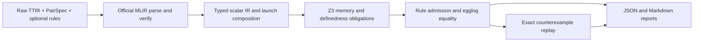

# ETV

[Chinese](README_cn.md)

ETV verifies observable-memory equivalence of TTIR programs under explicit launch,
ABI, shape and storage premises. Floats denote mathematical real numbers, not
IEEE-754 execution.



## Results

| Result | Meaning | Exit code |
| --- | --- | --- |
| `PROVED` | Required memory obligations closed and observation roots merged in egglog, under the reported premises and trust level. | 0 |
| `DISPROVED` | A concrete coverage, mask, address, race or value counterexample was replayed. | 1 |
| `UNKNOWN` | An input, unsupported operation, unresolved obligation or resource bound prevented a verdict. | 2 |

Failure to merge roots is not evidence of inequivalence. A hit on an admitted,
unverified rewrite makes `PROVED` conditional on that rule; inspect
`soundness.level` and `trusted_axioms`.

## Install and Run

The primary target is Linux, Python 3.12 and a C++17 compiler. No GPU or LLM
credentials are needed to verify saved TTIR. Dependencies are pinned in
`pyproject.toml` and `uv.lock`: Triton 3.7.1, egglog 13.2.0 and z3-solver 4.16.0.0.

```bash
uv sync --locked --extra dev --extra ttir
uv run --no-sync python tools/fetch_llvm_headers.py
uv run --no-sync python tools/build_adapter.py --llvm-include build/llvm/llvm-1f126a6d-ubuntu-x64-1/include
uv run --no-sync etv verify examples/add/pair.json --out build/add --json
```

The header download reads Triton's official LLVM archive and can be large. The
small local C++ adapter reads verified MLIR objects without modifying Triton.
Linux ARM64 uses the `ubuntu-arm64` include directory. See
[installation](docs/installation.md) for platform details.

`build/add/report.json` contains the facts; `report.md` renders them. With `--json`,
stdout contains one JSON object and diagnostics go to stderr. Optional
`--log-format jsonl --log-file build/add/events.jsonl` records structured events.

```bash
uv run --no-sync etv verify examples/add/pair_parametric.json --out build/parametric
uv run --no-sync etv verify examples/multilaunch/pair.json --out build/multilaunch
uv run --no-sync etv verify examples/compute_mismatch/pair.json --out build/incorrect
uv run --no-sync etv verify examples/unsupported/pair.json --out build/unsupported
uv run --no-sync etv parse examples/multilaunch/lhs.ttir --function lhs --out build/snapshot.json
uv run --no-sync etv rules check examples/rules/fadd_zero.json --json
```

The incorrect and unsupported cases intentionally exit 1 and 2. `rules check`
checks schema; admission and formal validation happen during `verify` in a
PairSpec context. [Examples](examples/README.md) lists expected results.

## PairSpec

Only `etv-pair-v3` is accepted. Each side is a nonempty list of physical launches.
This is one launch from the complete [copy/increment contract](examples/compute_mismatch/pair.json):

```json
{
  "id": "lhs.0", "file": "lhs.ttir", "function": "lhs", "step": 0,
  "grid": {"programs": 1},
  "stores": [{"index": 0, "role": "Output"}],
  "abi": {
    "Input": {"kind": "block", "name": "arg0"},
    "Output": {"kind": "block", "name": "arg1"}
  },
  "bindings": {}
}
```

The surrounding contract declares metadata/limits, both launch lists, logical
roles, integer bindings or bounded parameters, formal constraints, explicit
disjointness, the observed role/element count and optional rewrite files. Paths
stay within the PairSpec directory unless `--allow-external-paths` is supplied.
Unknown fields, ambiguous ABI endpoints and invalid domains are rejected.
Natural-language `assumptions.for_llm` never become formal premises. See
[the schema](docs/pairspec.md).

## Benchmark Artifacts

`etv_bench` captures and pairs artifacts; `etv` consumes them. The verifier never
imports PyTorch, ntops or ninetoothed. Automatic capture, reviewed candidates and
manual fixtures share `manifest.json`, raw TTIR, `pair.json`, `provenance.json` and
`expected.json`. `ready` means the contract is usable, not that the pair is equivalent.

```bash
uv run --no-sync etv-bench run examples/add/manifest.json --out build/benchmark
uv run --no-sync etv-bench summarize build/benchmark/report.json
```

CUDA generation uses a separate PyTorch 2.8.0 benchmark environment; its Triton
dependency must not replace the verifier frontend. Runtime slots come from the
selected compiler signature, including ordinary integers equal to 1. Ambiguous
mappings become `needs_review`. CPU tests cover capture/artifact contracts; real
GPU capture is a separate optional job. See [generation and review](docs/benchmark.md).

## Semantics and Trust

The acyclic subset includes static tensor index maps, masked float loads/stores,
integer addresses/casts, real arithmetic, comparisons, select, min/max/clamp, pure
math operations and whitelisted externs. Integers retain widths and modular
arithmetic; signed division truncates toward zero. Division by zero and signed
division overflow must be unreachable. Index casts need `target.index_bits`.
Casts remain typed nodes, and partial real functions require domain proofs.
Transcendentals may prove equal by structure/congruence; approximate evaluation
cannot produce a counterexample.

Launches at one step read the old state and commit together; later steps see their
writes. Fixed cases enumerate every program/lane/store within the resource bound.
Parameterized verification currently supports one launch and one store per side
with a provable canonical linear writer. Fixed single-side multi-launch is supported.
Both-side multi-launch, parameterized launch DAGs, loops/reductions, atomics, shared
memory, barriers, multidimensional grids, dynamic rank and integer memory are
explicit `UNKNOWN` cases.

Conclusions assume the declared ABI, host schedule, storage separation and custom
premises. They do not establish IEEE rounding, NaN/Inf/signed-zero behavior,
tolerance equivalence or host correctness. Reports contain dependencies and rule
matches, not independent proof certificates. Optional LLM proposals and partitions
are bounded; invalid proposals fall back to whole-goal verification. See
[soundness](docs/soundness.md) and [supported TTIR](docs/supported_ttir.md).

## Development

```text
src/etv/          verifier, immutable IR, official frontend, obligations and reports
src/etv_bench/    capture, pairing, audited conversion, review and aggregation
native/          read-only MLIR snapshot adapter
examples/        small raw TTIR acceptance artifacts and provenance
tests/           semantic property tests and CLI/integration regressions
tools/           adapter build, pinned upstream revisions and smoke commands
```

```bash
uv run --no-sync pytest
uv run --no-sync ruff check src tests tools examples/generators
uv run --no-sync ruff format --check src tests tools examples/generators
uv run --no-sync mypy
uv run --no-sync python -m build
uv run --no-sync python tools/smoke.py
```

Core unit checks run without Triton. Full integration needs the pinned frontend
and built adapter. Linux CI includes both jobs; CUDA capture is a separate manual
workflow. Read [architecture](docs/architecture.md), [verification](docs/verification.md),
[rewrites](docs/rewrites.md) and [development](docs/development.md) for extension boundaries.

## License

[MIT](LICENSE).
