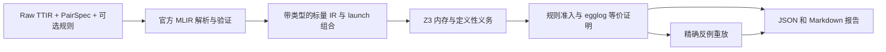

# ETV

[English](README.md)

ETV 在明确声明的 launch、ABI、shape 和 storage 前提下验证 TTIR 程序的可观察内存等价性。
浮点模式表示数学实数，不表示 IEEE-754 执行语义。



## 验证结果

| 结果 | 含义 | 退出码 |
| --- | --- | --- |
| `PROVED` | 必要内存义务已关闭，观察根在 egglog 中合并；结论受报告中的前提和信任等级约束。 | 0 |
| `DISPROVED` | 已重放具体的覆盖、mask、地址、重复写或值差异反例。 | 1 |
| `UNKNOWN` | 输入问题、未支持操作、未关闭义务或资源上限阻止了判定。 | 2 |

根未合并不表示不等价。若实际命中已准入但未验证的 rewrite，`PROVED` 依赖该规则成立；
应检查 `soundness.level` 和 `trusted_axioms`。

## 安装与运行

主要目标是 Linux、Python 3.12 和支持 C++17 的编译器。验证已保存的 TTIR 不需要 GPU 或
LLM 凭据。`pyproject.toml` 和 `uv.lock` 固定依赖版本：Triton 3.7.1、egglog 13.2.0 和
z3-solver 4.16.0.0。

```bash
uv sync --locked --extra dev --extra ttir
uv run --no-sync python tools/fetch_llvm_headers.py
uv run --no-sync python tools/build_adapter.py --llvm-include build/llvm/llvm-1f126a6d-ubuntu-x64-1/include
uv run --no-sync etv verify examples/add/pair.json --out build/add --json
```

下载头文件需要读取 Triton 官方 LLVM 压缩包，流量可能较大。本仓库的小型 C++ 适配器只读取
已验证的 MLIR 对象，不修改 Triton。Linux ARM64 使用 `ubuntu-arm64` 头文件目录。
平台细节见[安装文档](docs/installation.md)。

`build/add/report.json` 保存事实，`report.md` 根据这些事实生成。使用 `--json` 时，stdout
只输出一个 JSON 对象，诊断写入 stderr。可用
`--log-format jsonl --log-file build/add/events.jsonl` 保存结构化事件。

```bash
uv run --no-sync etv verify examples/add/pair_parametric.json --out build/parametric
uv run --no-sync etv verify examples/multilaunch/pair.json --out build/multilaunch
uv run --no-sync etv verify examples/compute_mismatch/pair.json --out build/incorrect
uv run --no-sync etv verify examples/unsupported/pair.json --out build/unsupported
uv run --no-sync etv parse examples/multilaunch/lhs.ttir --function lhs --out build/snapshot.json
uv run --no-sync etv rules check examples/rules/fadd_zero.json --json
```

错误和未支持示例预期分别返回退出码 1 和 2。`rules check` 检查 schema；规则准入和形式验证
在 `verify` 的 PairSpec 上下文中进行。[示例目录](examples/README.md)列出预期结果。

## PairSpec

生产输入仅接受 `etv-pair-v3`。每侧是非空的物理 launch 数组。下面是完整
[copy/increment 契约](examples/compute_mismatch/pair.json)中的一个 launch：

```json
{
  "id": "lhs.0", "file": "lhs.ttir", "function": "lhs", "step": 0,
  "grid": {"programs": 1},
  "stores": [{"index": 0, "role": "Output"}],
  "abi": {
    "Input": {"kind": "block", "name": "arg0"},
    "Output": {"kind": "block", "name": "arg1"}
  },
  "bindings": {}
}
```

完整契约还声明 metadata/资源限制、两侧 launch、逻辑角色、整数 binding 或有界参数、形式
约束、显式 disjoint、观察角色/元素数量和可选 rewrite 文件。路径必须位于 PairSpec 目录内，
除非显式指定 `--allow-external-paths`。未知字段、含混 ABI endpoint 和非法参数域会被拒绝。
自然语言 `assumptions.for_llm` 不进入形式前提。详见 [schema](docs/pairspec.md)。

## Benchmark Artifact

`etv_bench` 负责采集和配对，`etv` 负责消费 artifact。验证器不导入 PyTorch、ntops 或
ninetoothed。自动采集、人工审阅候选和手工 fixture 使用相同的 `manifest.json`、raw TTIR、
`pair.json`、`provenance.json` 和 `expected.json` 契约。`ready` 仅表示契约可用，不表示等价。

```bash
uv run --no-sync etv-bench run examples/add/manifest.json --out build/benchmark
uv run --no-sync etv-bench summarize build/benchmark/report.json
```

CUDA 生成使用独立的 PyTorch 2.8.0 benchmark 环境；其 Triton 依赖不能替换验证器前端。
运行时 slot 来自实际选中的编译 signature，值为 1 的普通整数也会保留。含混映射标记为
`needs_review`。CPU 测试覆盖采集/artifact 契约；GPU 实机采集属于单独的可选 job。
详见[生成与审阅](docs/benchmark.md)。

## 语义与信任

无环子集包含静态 tensor 索引映射、带 mask 的浮点 load/store、整数地址/cast、实数运算、
比较、select、min/max/clamp、纯 math 操作和白名单 extern。整数保留位宽并使用模运算；
有符号除法向零截断。必须证明除零和有符号除法溢出不可达。index cast 需要
`target.index_bits`。cast 保留为带类型节点，部分实函数需要定义域证明。超越函数可以通过
结构相等/同余证明等价；近似求值不能生成反例。

同 step 的 launch 读取旧状态并同时提交；后续 step 可见之前的写入。固定路径在资源限制内
穷举全部 program/lane/store。参数化路径目前支持每侧一个 launch、一个 store，且需要证明
规范线性 writer。固定规模支持单侧多 launch。双侧多 launch、参数化 launch DAG、循环/
reduction、原子操作、shared memory、barrier、多维 grid、动态 rank 和整数内存显式返回
`UNKNOWN`。

结论依赖声明的 ABI、host 顺序、storage 分离和自定义前提，不证明 IEEE 舍入、NaN/Inf/
signed-zero 行为、容差等价或 host 正确性。报告包含依赖事实和规则命中次数，不是独立
proof certificate。可选 LLM 候选和划分均有资源限制；非法候选回退到整图验证。详见
[健全性](docs/soundness.md)和[支持的 TTIR](docs/supported_ttir.md)。

## 开发

```text
src/etv/          验证器、不可变 IR、官方前端、证明义务与报告
src/etv_bench/    采集、配对、可审计转换、审阅与汇总
native/          只读 MLIR 快照适配器
examples/        小型 raw TTIR 验收样例与 provenance
tests/           语义属性测试、CLI 与集成回归
tools/           适配器构建、固定上游 revision 和 smoke 命令
```

```bash
uv run --no-sync pytest
uv run --no-sync ruff check src tests tools examples/generators
uv run --no-sync ruff format --check src tests tools examples/generators
uv run --no-sync mypy
uv run --no-sync python -m build
uv run --no-sync python tools/smoke.py
```

核心单元检查无需 Triton；完整集成需要固定前端和已构建适配器。Linux CI 包含这两类 job，
CUDA 采集是单独手动触发的 workflow。扩展边界见[架构](docs/architecture.md)、
[验证](docs/verification.md)、[rewrite](docs/rewrites.md)和[开发](docs/development.md)。

## 许可证

[MIT](LICENSE)。
