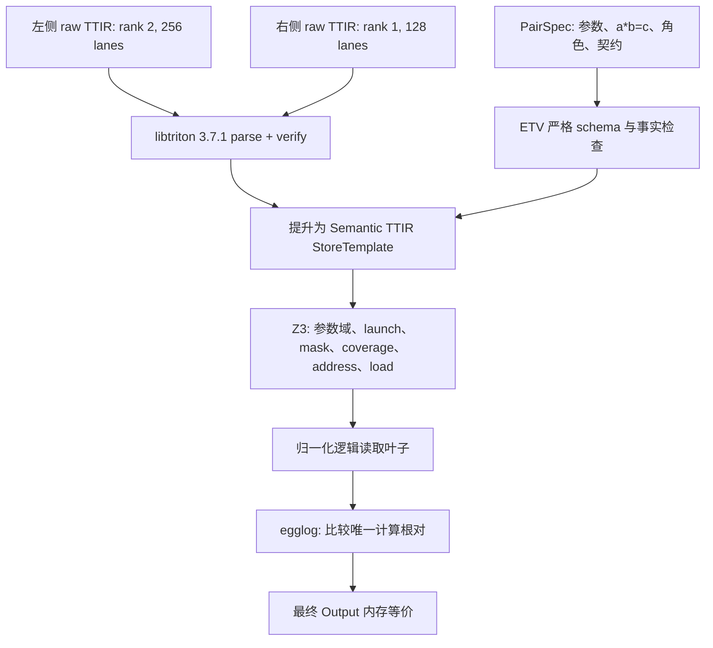

# 参数化 Add 验证全过程

本文逐步记录 `examples/add/pair_parametric.json` 的一次真实验证。目标是在固定
rank、符号 shape 的范围内证明：对任意正 signed-i32 参数 `a`、`b`、`c`，只要
`a*b=c`，使用二维行主序地址的 Add kernel 与使用一维线性地址的 Add kernel
产生相同的最终 `Output` 内存。

本文描述的是当前实现和实际 `report.json` 中发生的过程。一个容易误解但很重要的
事实是：本例有 17 条内建代数规则通过准入，但实际应用规则的序列为空。SMT 在
e-graph 之前已经证明并归一化了地址和读取叶子；两个浮点计算根插入 e-graph 时
结构完全相同，因此验证器直接以同余完成计算证明，没有运行第 1 次规则饱和迭代。

## 1. 输入、命令与最终结果

验证有三个原始输入：

| 输入 | 作用 |
| --- | --- |
| `examples/add/ttir/parametric_2d_add.ttir` | 左侧 raw TTIR；shape 为 `[a,b]`，256 lanes/program |
| `examples/add/ttir/parametric_1d_add.ttir` | 右侧 raw TTIR；shape 为 `[c]`，128 lanes/program |
| `examples/add/pair_parametric.json` | 声明前端、launch、角色、参数域、关系约束、no-alias 和验证契约 |

本次报告记录的输入 SHA-256 为：

| 输入 | SHA-256 |
| --- | --- |
| 左侧 TTIR | `f963453962d40f5d7e0db2d2ffb171f578b1121daec01a8aba89bf7b9b8360ba` |
| 右侧 TTIR | `5682274295157a75e22a57c46c33cfb8561139ef807aeccf2d660be5c6d229d0` |
| PairSpec | `478a5145601130410ba6d5c02a8317d65b21e5d713a0208e431aedd781444cbd` |

这两份参数化 TTIR 是用于符号证明的可审计基准，不是
`examples/add/provenance.json` 声明的上游编译 artifact；真实上游固定 shape pair
仍由 `examples/add/pair.json` 描述。

执行命令：

```bash
python -m etv check examples/add/pair_parametric.json \
  --out build/add_parametric_raw
```

实际输出：

```text
PROVED parametric_2d_add_vs_1d_add: OBSERVABLE_MEMORY_EQUIVALENT
```

报告中的证明范围是：

```text
fixed-rank symbolic-shape single-store parametric translation validation
```

也就是固定 rank 2 对 rank 1、每侧恰好一个 store、固定 launch 公式，但 shape
维度值在完整声明域中任取，而不是只测试几个样例。



## 2. PairSpec 给验证器的事实

### 2.1 参数域与关系

PairSpec 声明：

```text
1 <= a <= 2147483647
1 <= b <= 2147483647
1 <= c <= 2147483647
imul(a, b) == c
```

这里的 `imul` 不是无界数学乘法的无条件假设。SMT 编码同时加入 signed-i32
定义性条件，所以只量化乘积可由 signed-i32 表示并等于 `c` 的参数组合。底层使用
Z3 `Int`，再显式加入每次 `iadd/isub/imul/idiv/irem/ceildiv` 的 i32 范围或定义域
条件，而不是静默允许机器整数溢出。

参数域首先要可满足。实际模型为：

```text
a = 1, b = 1, c = 1
```

这个模型只用于证明前提不是空集；后续结论仍然对整个声明域全称成立。

### 2.2 launch 与输出契约

PairSpec 补充 raw TTIR 中没有编码的 launch grid：

```text
lhs.programs = ceildiv(c, 256)
rhs.programs = ceildiv(c, 128)
contract.output_numel = c
```

契约要求 `Output[0,c)` 完整覆盖，且 `Input`、`Other`、`Output` 两两不相交。
验证器必须证明两侧每个逻辑输出都有且只有一个 writer、物理输出地址无竞争、两侧
对应 writer 地址相同，才能进入计算等价检查。

### 2.3 物理 ABI 到逻辑角色

两份 TTIR 的参数位置不同。PairSpec 使用逻辑角色消除这个物理 ABI 差异：

| 逻辑角色 | 左侧 | 右侧 |
| --- | --- | --- |
| `Input` | block `arg0` | block `arg0` |
| `Other` | block `arg1` | block `arg2` |
| `Alpha` | scalar `arg2` | scalar-block `arg1[0]` |
| `Output` | block `arg3` | block `arg3` |

shape 参数也按 side 单独绑定：

```text
lhs.arg4 = a
lhs.arg5 = b
rhs.arg4 = c
```

角色对应、参数绑定、关系约束和 no-alias 都是 PairSpec 提供的可信事实。验证器会
检查这些事实是否足以关闭证明义务，但不会证明调用者提供的 shape 元数据本身来自
真实运行时对象。

## 3. 两份原始 TTIR 分别做什么

### 3.1 左侧二维 kernel

对 program id `pid` 和 lane id `lane`，左侧 TTIR 计算：

```text
k_lhs   = pid * 256 + lane
numel   = a * b
mask    = k_lhs < a*b
row     = k_lhs div b
column  = k_lhs rem b
offset  = row*b + column
value   = Input[offset] + Alpha * Other[offset]
```

有效 lane 把结果写到 `Output[offset]`。`divsi` 和 `remsi` 使用 signed 语义；在
本证明的有效域中 `k>=0`、`b>0`，因此它们与常见的非负整数商和余数一致。

### 3.2 右侧一维 kernel

右侧计算：

```text
k_rhs  = pid * 128 + lane
mask   = k_rhs < c
offset = k_rhs
Alpha  = load(arg1, offset=0)
value  = Input[offset] + Alpha * Other[offset]
```

两侧 lane 数和 launch program 数不同，Alpha 的 ABI 也不同，所以不能只比较 TTIR
文本或 SSA 结构。验证目标是相同逻辑输出 `k` 上的可观察内存行为。

## 4. libtriton 解析与 Semantic TTIR 提升

ETV 固定使用 Triton/libtriton 3.7.1。两份 raw TTIR 都依次经过：

1. 注册 MLIR/Triton 方言；
2. `parse_mlir_module` 解析完整语法；
3. MLIR verifier 检查 SSA、类型和 operation 约束；
4. 选择 PairSpec 指定的函数；
5. 将支持的 acyclic pointwise 子集提升为类型化 Semantic TTIR；
6. 每侧生成一个 `StoreTemplate`。

提升器不以正则表达式替代 TTIR 模块解析。libtriton 已经完成解析和 verifier；
提升器遍历类型化 operation/value，再将 `arith.muli`、`arith.divsi`、
`tt.addptr`、`tt.load`、`arith.mulf`、`arith.addf` 和 `tt.store` 等映射到
Semantic TTIR 表达式。canonical operation assembly 只作为少量属性读取的后备
元数据，不承担模块语法或 SSA 解析。

实际提升结果可以概括为：

| 字段 | 左侧 | 右侧 |
| --- | --- | --- |
| programs | `ceildiv(c,256)` | `ceildiv(c,128)` |
| lanes | 256 | 128 |
| logical index | `pid*256+lane` | `pid*128+lane` |
| mask | `logical<a*b` | `logical<c` |
| output offset | `(logical div b)*b+(logical rem b)` | `logical` |
| store value | `load(Input)+Alpha*load(Other)` | `load(Input)+load(Alpha[0])*load(Other)` |

当前提升器要求每侧恰好一个 `tt.store`。region、循环、多 store、原子操作等即使能
被 libtriton 正确解析，也不会在这里被悄悄忽略，而会返回 `UNKNOWN`。

## 5. 参数化 SMT 证明

### 5.1 基础公式

令参数域与关系的合取为 `D(a,b,c)`：

```text
D := ranges(a,b,c)
  and i32_defined(a*b)
  and a*b=c
```

令任意待观察逻辑输出为：

```text
K(k) := 0 <= k < c
```

除“参数域可满足”外，每个证明义务都采用反例查询：

```text
D and counterexample
```

Z3 返回 `UNSAT` 表示在整个参数域内不存在该类反例。任一必要查询为 `SAT` 或
`UNKNOWN`，验证器都不会继续给出本次 `PROVED`。

### 5.2 canonical writer

对每一侧 lane 数 `L`，验证器为逻辑输出 `k` 构造 canonical writer：

```text
pid  = k div L
lane = k rem L
```

然后证明它位于 launch grid 中、mask 为真、logical index 等于 `k`。再引入第二组
`pid_2/lane_2`，证明不存在两个不同 lane 写同一逻辑输出，也不存在两个不同 lane
写同一物理地址。

### 5.3 地址等价不是 e-graph 浮点重写

对 canonical writer，左右输出地址分别为：

```text
lhs_offset(k) = (k div b)*b + (k rem b)
rhs_offset(k) = k
```

验证器查询：

```text
D and K(k) and lhs_offset(k) != rhs_offset(k)
```

结果为 `UNSAT`。这个等式连同除数非零、signed 除法定义性和中间 i32
可表示性，是 Z3 的整数证明，不是 `fadd_comm`、`fmul_comm` 等 e-graph 浮点规则。
这一区分避免把 shape/address 代数与计算表达式重写混在一起。

### 5.4 实际 39 次检查

报告记录 39 次求解器调用：1 次为 `SAT` 的非空域检查，其余 38 次反例查询均为
`UNSAT`。

| 序号 | 检查 | 数量 | 实际结果 | 关闭的风险 |
| --- | --- | ---: | --- | --- |
| 1 | `parameter-domain-satisfiable` | 1 | `SAT` | 排除空前提导致的真空证明 |
| 2 | `output-numel-positive-and-defined` | 1 | `UNSAT` | `c` 非正或定义失败 |
| 3-11 | 左侧 launch/index/mask/coverage/address/uniqueness/injectivity | 9 | 全部 `UNSAT` | 非法 lane、漏写、重复写、竞争、未定义地址 |
| 12-20 | 右侧同类义务 | 9 | 全部 `UNSAT` | 同上 |
| 21 | `lhs-rhs-output-address-equality` | 1 | `UNSAT` | 相同逻辑输出写入不同地址 |
| 22-27 | 左侧 Input/Other 两个 load 的 offset/mask 定义性与 mask 恒真 | 6 | 全部 `UNSAT` | 观察域上的未定义或条件读取 |
| 28-30 | 右侧 Input load 的同类检查 | 3 | 全部 `UNSAT` | 同上 |
| 31 | `read-offset:Input:0` | 1 | `UNSAT` | 左右 Input 读取不同 offset |
| 32-34 | 右侧 Alpha load 的 offset/mask 定义性与 mask 恒真 | 3 | 全部 `UNSAT` | Alpha 读取不稳定 |
| 35 | `rhs:scalar-block-offset` | 1 | `UNSAT` | Alpha 没有读取 PairSpec 声明的 `arg1[0]` |
| 36-38 | 右侧 Other load 的 offset/mask 定义性与 mask 恒真 | 3 | 全部 `UNSAT` | 观察域上的未定义或条件读取 |
| 39 | `read-offset:Other:0` | 1 | `UNSAT` | 左右 Other 读取不同 offset |

报告中的 `lhs:load-offset:defined`、`lhs:load-mask:defined`、
`lhs:load-mask-true` 名称各出现两次，因为左侧有 Input 和 Other 两个普通 load；
右侧对应名称各出现三次，因为还有 Alpha scalar-block load。每次调用仍有独立的
query hash，可以在 `report.json` 中逐项审计。

## 6. 从物理 load 到统一逻辑读取叶子

地址证明完成后，`SymbolicValueEvaluator` 在 `K(k)` 域上重建两侧浮点值。

左侧先建立两个逻辑读取 token：

```text
read(Input, symbolic_offset_Input_0)
read(Other, symbolic_offset_Other_0)
```

处理右侧时，`LeafRegistry` 使用 Z3 证明右侧 offset 分别与已有 Input/Other offset
相等，所以复用同一个 token，而不是创建新的叶子。右侧 `arg1[0]` 又由 ABI 角色和
`rhs:scalar-block-offset` 检查归一化为：

```text
input(Alpha)
```

因此进入计算验证的唯一根对是：

```text
lhs_root = fadd(
  read(Input, symbolic_offset_Input_0),
  fmul(input(Alpha), read(Other, symbolic_offset_Other_0)))

rhs_root = fadd(
  read(Input, symbolic_offset_Input_0),
  fmul(input(Alpha), read(Other, symbolic_offset_Other_0)))
```

两者是相同的类型化 `Expr`。这一步解释了为什么 raw TTIR 中复杂的二维地址和不同
Alpha ABI 不再出现在计算 e-graph 中：它们已由前面的 SMT/ABI 义务处理，而不是
被无条件删除。

## 7. 重写规则的准入、条件与目标

### 7.1 规则准入与规则应用是两件事

本 PairSpec 没有声明 `rewrite_rules`，也没有启用 LLM。默认规则策略为：

```text
rule_policy.algebraic_validation = required
semantic_mode = abstract_float
```

验证器仍会对 17 条内建浮点代数规则执行准入。每条规则的公共准入条件是：

1. 当前语义必须是 `ABSTRACT_FLOAT`；
2. 将 pattern 变量编码为 Z3 Real；
3. 查询 `lhs != rhs`；
4. 只有结果为 `UNSAT` 才标记为 `proved` 并允许进入 egglog ruleset。

若真的运行饱和，一条规则还必须满足以下应用条件：

1. e-graph 中存在与规则左侧 pattern 匹配的节点；
2. 该规则已经通过准入及其 fact requirements；
3. 饱和没有超过 `max_iterations=8`、`max_enodes=20000`、`timeout_ms=10000`；
4. egglog 将匹配根与规则右侧做 `union`，而不是用字符串替换旧节点。

### 7.2 本例准入的 17 条规则

所有规则的 `requires` 都是 `semantic_mode == abstract_float`，所有 Z3 准入查询都为
`UNSAT`。下表的“实际匹配”全部为 0；原因不是所有 pattern 都无法匹配，而是根在
饱和前已经同余，验证器根本没有调用 ruleset。

| ID | 等式 | 实际匹配/应用 |
| --- | --- | ---: |
| `fadd_comm` | `a+b = b+a` | 0 |
| `fadd_assoc` | `(a+b)+c = a+(b+c)` | 0 |
| `fmul_comm` | `a*b = b*a` | 0 |
| `fmul_assoc` | `(a*b)*c = a*(b*c)` | 0 |
| `fadd_zero` | `a+0 = a` | 0 |
| `fmul_one` | `a*1 = a` | 0 |
| `fmul_zero` | `a*0 = 0` | 0 |
| `fdiv_one` | `a/1 = a` | 0 |
| `fsub_def` | `a-b = a+(-b)` | 0 |
| `fneg_involution` | `-(-a) = a` | 0 |
| `fsub_zero` | `a-0 = a` | 0 |
| `fsub_self` | `a-a = 0` | 0 |
| `fadd_inverse` | `a+(-a) = 0` | 0 |
| `fneg_zero` | `-0 = 0` | 0 |
| `fmul_add_distrib` | `a*(b+c) = a*b+a*c` | 0 |
| `fmul_sub_distrib` | `a*(b-c) = a*b-a*c` | 0 |
| `fma_def` | `fma(a,b,c) = a*b+c` | 0 |

这里没有 fact-gated 规则、未经证明规则或 LLM 生成规则，所以：

```text
trusted_rule_uses    = []
unverified_rule_uses = []
```

### 7.3 重写目标和成功条件

规则不是用来改写整个 TTIR，也不是用来证明 launch 或地址。它只面向第 6 节得到
的浮点计算根对。计算成功条件是：

```text
eclass(lhs_root) == eclass(rhs_root)
```

如果初始不相等，验证器才运行统一 ruleset；若常规饱和后仍不相等且 PairSpec 显式
启用 LLM，才会把未匹配根交给 LLM 选择和提出带条件规则。本例初始即相等，因此
这两个分支都没有执行。

## 8. e-graph 的真实逐步状态

### 8.1 阶段 0：空图

开始时：

```text
e-nodes  = 0
e-classes = 0
roots     = []
```

17 条规则已经完成准入，但尚未注册为一个运行中的 ruleset。

### 8.2 阶段 1：插入左侧根

`add_expr(lhs_root)` 递归插入 7 个节点。概念上的 e-class 为：

| e-class | 唯一 e-node |
| --- | --- |
| `C0` | `var(symbolic_offset_Input_0)` |
| `C1` | `read(Input, C0)` |
| `C2` | `input(Alpha)` |
| `C3` | `var(symbolic_offset_Other_0)` |
| `C4` | `read(Other, C3)` |
| `C5` | `fmul(C2, C4)` |
| `C6` | `fadd(C1, C5)` |

左侧根 `etv_root_0` 指向 `C6`：

```text
e-nodes   = 7
e-classes = 7
```

此时没有应用规则，也没有显式 union。

### 8.3 阶段 2：插入右侧根

`add_expr(rhs_root)` 递归遇到完全相同的 op、children、data 和 sort。egglog 的
hash-consing 复用 `C0..C6`，不创建新节点：

```text
etv_root_0 -> C6
etv_root_1 -> C6

e-nodes   = 7
e-classes = 7
```

这不是通过 `fadd_comm` 或其他规则合并的。两个 root 在创建时就引用同一 canonical
term/e-class。

### 8.4 阶段 3：rebuild 与初始同余检查

ETV 调用 `rebuild()`；egglog 在注册表达式时已经维护图结构，这个包装方法不会增加
节点。随后检查：

```text
equivalent(etv_root_0, etv_root_1) == true
initially_unmatched == []
```

图仍为 7 e-node、7 e-class。

### 8.5 阶段 4：饱和决策

验证器的分支是：

```text
if initially_unmatched:
    saturate(admitted_rules)
else:
    stop_reason = ROOTS_ALREADY_CONGRUENT
```

本例走 `else`。因此真实规则应用序列为：

```text
[]
```

不存在“应用第 1 条规则之后”的实际图，也不存在第 1 次 egglog ruleset 迭代。
报告中的 `iterations=0` 表示饱和没有启动，不是运行了一轮但没有匹配。

最终 e-graph 统计：

```text
root_pairs            = 1
equivalent_root_pairs = 1
e-nodes               = 7
e-classes             = 7
iterations            = 0
rule_matches          = {}
rule_applications     = {}
stop_reason           = ROOTS_ALREADY_CONGRUENT
```

### 8.6 辅助示意：单条规则会怎样改变图

本小节不是本次报告的执行轨迹，只用于解释“应用一条规则后 e-graph 发生什么”。
假设强制对第 8.2 节的图运行交换律：

1. `fmul_comm` 匹配 `C5 = fmul(C2,C4)`；新增 e-node
   `fmul(C4,C2)`，并将它 union 到 `C5`。概念统计变为 8 e-node、7 e-class。
2. `fadd_comm` 匹配 `C6 = fadd(C1,C5)`；新增 e-node
   `fadd(C5,C1)`，并将它 union 到 `C6`。概念统计变为 9 e-node、7 e-class。

旧节点不会被删除；同一个 e-class 同时保存多个等价表示。这正是 equality
saturation 与单向 AST 替换的区别。实际 ETV 使用统一 ruleset，一次迭代可能同时
匹配多条规则，所以只有报告中的 match count 才是实际轨迹；上面的逐条数字只是
隔离规则后的教学示意。

## 9. 从计算同余到最终内存等价

计算根同余还不是最终结论。`STORE` block 组合此前已经关闭的义务：

```text
same active domain
and same unique writer
and same output address
and same computed value
and all non-Output logical blocks unchanged
=> same final Output memory
```

本次报告的 12 个必要 proof block 全部为 `PROVED`：

| Block | 主要证据 |
| --- | --- |
| `FRONTEND` | libtriton parse/verify，`STRUCTURAL` |
| `ABI` | PairSpec 角色对应，`TRUSTED_AXIOM` |
| `PARAMETER_DOMAIN` | `PARAMETRIC_SMT` |
| `INDEX` | `PARAMETRIC_SMT` |
| `MASK` | `PARAMETRIC_SMT` |
| `COVERAGE` | `PARAMETRIC_SMT` |
| `RACE_FREEDOM` | `PARAMETRIC_SMT` |
| `ADDRESS` | `PARAMETRIC_SMT` |
| `LOAD` | `PARAMETRIC_SMT` 证明后的叶子归一化 |
| `DEFINEDNESS` | 浮点表达式结构检查，`STRUCTURAL` |
| `COMPUTE` | e-graph `CONGRUENCE` |
| `STORE` | `PARAMETRIC_SMT + CONGRUENCE` |

任何一个 required block 不能关闭，最终状态都不会是 `PROVED`。

## 10. 证明了什么，没有证明什么

本例证明：对所有满足声明域和 `a*b=c` 关系的 shape 参数，以及所有
`ABSTRACT_FLOAT` 输入值，两侧产生相同的最终 `Output` 内存。

它没有证明：

- IEEE-754、容差或 GPU bitwise 等价；
- 动态 rank、循环、多 store、原子操作或 shared-memory 语义；
- 任意 stride、dtype、target 或 PairSpec 之外的 launch；
- 分配 buffer 的真实边界安全；
- 调用者提供的 shape/role/no-alias 事实一定符合运行时；
- TTIR-to-Semantic-TTIR 提升器自身的形式正确性。

当前可信计算基包括 PairSpec 事实、`ABSTRACT_FLOAT` 解释、Semantic TTIR/内存模型、
TTIR 提升器、Z3、egglog 以及报告生成逻辑。由于本例没有使用未经验证的重写规则，
不存在额外的 rule-specific trusted axiom。

## 11. 如何复核

重新运行验证后，可直接查看：

```bash
jq '.proof.parametric_domain.checks' build/add_parametric_raw/report.json
jq '.proof.egraph' build/add_parametric_raw/report.json
```

重点字段应为：

```text
proof.parametric_domain.complete_for_parameter_domain = true
proof.egraph.root_pairs = 1
proof.egraph.equivalent_root_pairs = 1
proof.egraph.stats.iterations = 0
proof.egraph.stats.stop_reason = ROOTS_ALREADY_CONGRUENT
proof.egraph.trusted_rule_uses = []
proof.egraph.unverified_rule_uses = []
```

更一般的验证器契约见[完整验证过程](verification_process.md)，真实上游固定 shape
Add 的来源与验证见[真实 Add 验证](add_validation.md)，当前能力边界见
[实现状态](implementation_status.md)。
